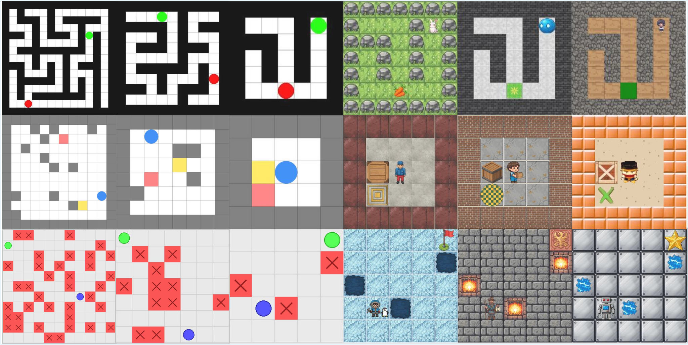

<div align="center">

# VR-Bench：视觉语言模型的视觉推理基准

</div>

<div align="center" style="font-size: 15pt">

<a href='https://arxiv.org/abs/2511.15065'></a>
<a href='https://huggingface.co/papers/2511.15065'></a>
<a href='https://imyangc7.github.io/VRBench_Web/'></a>
<a href='https://huggingface.co/datasets/amagipeng/VR-Bench'></a>
<a href='https://huggingface.co/HY-Wan/Wan-R1'></a>

</div>

中文文档 | [English](README.md)

VR-Bench 是一个综合基准，用于通过各种益智游戏评估视觉语言模型 (VLM) 的空间推理和规划任务。它为数据集生成、评估和分析提供了统一的框架。

## 🧩 基准概述

VR-Bench 概述。 (A) 迷宫类型。 VR-Bench 包括五种迷宫类型：规则迷宫、不规则迷宫、3D 迷宫、Trapfield 和 Sokoban，涵盖 2D 和 3D 设置以及不同的任务结构，产生广泛的空间推理场景。 (B) 通过视频范式进行推理。 VR-Bench 采用帧链推理范式，要求模型产生逐帧推理，以捕获顺序视觉推理。 (C) 基准表现。领先的 VLM 和视频模型根据所有迷宫类型的四个核心指标进行评估，揭示了空间推理能力的明显差异。 (D) 附加分析。 VR-Bench还支持难度泛化、纹理泛化、迷宫型泛化和测试时间缩放等评估，从而能够全面评估模型的鲁棒性和泛化能力。


为了评估 VTR 任务的泛化能力并增强适应不同迷宫场景的鲁棒性，我们引入了两个关键维度的变化：（1）**难度等级**：我们通过调整迷宫大小（例如从 5×5 扩展到 7×7）、修改迷宫分支数量和添加障碍来定义三个难度等级（简单、中等和困难）； (2) **迷宫纹理**：我们使用通过程序方法和生成模型生成的纹理来改变迷宫障碍物、路径和其他组件的纹理，这将策略暴露于广泛的视觉分布，并减轻了对干净的合成环境的过度拟合。



## 🎮 支持的游戏

VR-Bench 包括五种不同的益智游戏，每种游戏都测试视觉推理的不同方面：

- **迷宫**：在基于网格的迷宫中从起点导航到目标
- **推箱子**：将盒子推到目标位置，同时避开墙壁
- **3D迷宫**：多层迷宫，带有连接不同楼层的梯子
- **路径查找器**：通过带有标记的路点的不规则迷宫查找路径
- **TrapField**：在场地中导航，同时避免陷阱

## ✨ 主要特点

- **程序生成**：自动生成具有可配置难度的不同谜题级别
- **纹理自定义**：通过纹理皮肤支持自定义视觉主题
- **视频渲染**：生成具有流畅动画的解决方案视频（24 FPS）
- **VLM评估**：用于测试各种VLM（GPT、Gemini、Qwen等）的内置框架
- **综合指标**：成功率（SR）、路径比率（PR）、移动比率（MR）
- **并行处理**：多线程生成和评估以提高效率
- **重复数据删除**：自动检测和删除重复级别

## 📋 要求

- Python >= 3.10
- CUDA兼容GPU（可选，用于本地VLM推理）

## 🚀 快速入门

### 1.安装

```bash
# Clone the repository
git clone https://github.com/ImYangC7/VR-Bench.git
cd VR-Bench

# Install dependencies
pip install -r requirements.txt
```

### 2.下载数据集

```bash
# Download pre-generated dataset from Hugging Face
python dataset_init.py --output-dir ./dataset_VR
```

### 3. 生成自定义关卡

```bash
# Edit config/config.yaml to configure game type and difficulty
# Then run batch generation
python -m generation.batch_generate config/config.yaml
```

## 🏋️‍♂️ 训练模型

我们使用 [DiffSynth-Studio](https://github.com/modelscope/DiffSynth-Studio) 进行扩散模型训练和推理。安装：

```bash
git clone https://github.com/modelscope/DiffSynth-Studio.git
cd DiffSynth-Studio
pip install -e .
```

安装后，**确保在启动实验之前更新训练脚本中的数据集路径、超参数和输出目录**。

这是一个参考配置：

```bash
accelerate launch examples/wanvideo/model_training/train.py \
  --dataset_base_path data/example_video_dataset \
  --dataset_metadata_path data/example_video_dataset/metadata.csv \
  --height 512 \
  --width 512 \
  --num_frames 193 \
  --dataset_repeat 100 \
  --model_id_with_origin_paths "Wan-AI/Wan2.2-TI2V-5B:diffusion_pytorch_model*.safetensors,Wan-AI/Wan2.2-TI2V-5B:models_t5_umt5-xxl-enc-bf16.pth,Wan-AI/Wan2.2-TI2V-5B:Wan2.2_VAE.pth" \
  --learning_rate 1e-4 \
  --num_epochs 5 \
  --remove_prefix_in_ckpt "pipe.dit." \
  --output_path "./models/train/Wan2.2-TI2V-5B_lora" \
  --lora_base_model "dit" \
  --lora_target_modules "q,k,v,o,ffn.0,ffn.2" \
  --lora_rank 32 \
  --extra_inputs "input_image" 
```

使用您的特定数据位置编辑上面的脚本。

## 🎯 评估方法

### 视频模型（轨迹推理）

```bash
# Evaluate generated videos against GT trajectories (auto-matches difficulties)
bash scripts/videomodel_evaluate.sh

# Or run directly
python evaluation/videomodel_eval/batch_evaluate.py \
  DATASET_DIR OUTPUT_DIR RESULT_DIR \   # DATASET_DIR=GT dataset root, OUTPUT_DIR=model outputs, RESULT_DIR=eval outputs
  --gpu   # optional
```

### VLM（计划/行动推理）

1）配置环境：`cp .env.example .env`并填写API密钥、数据集路径、CUDA等。  
2）（可选/本地机型）启动VLM服务：

```bash
bash scripts/start_sglang_server.sh
```

3) 对数据集结果运行VLM评估：

```bash
bash scripts/run_vlm_eval.sh
```

## 📊 评估指标

- **PR（精确率）**：保持在 GT 路径较小公差范围内的重采样点的分数；测量路径形状的一致性。
- **SR（成功率）**：生成的轨迹（推箱子的玩家或盒子）是否至少进入目标边界框一次。
- **SD​​（步长偏差）**：相对路径长度超限与 GT (`len_gen / len_gt - 1`)，仅在 SR=1 且非负时定义。
- **EM（精确匹配）**：当 PR 超过阈值且 |SD| 时完美标记 (1/0)很小，条件是 SR=1。
- **MF（掩模保真度）**：背景稳定性得分 [0,1]；将采样帧与第一帧进行比较，同时屏蔽开始/目标/玩家区域。

## 🧪 评价

训练模型后，您可以使用我们提供的推理脚本对其进行评估：

1. **复制推理脚本**：将评估脚本从 VR-Bench 复制到 DiffSynth-Studio：
```bash
   cp VR-Bench/scripts/Wan2.2-TI2V-5B_lora.py DiffSynth-Studio/examples/wanvideo/model_inference/
```

2. **更新路径**：编辑复制的脚本以根据您的设置更新路径：
   - 更新LoRA检查点路径
   - 更新输入图像路径
   - 更新输出视频路径
   - 根据需要自定义提示

3. **运行评估**：
```bash
   cd DiffSynth-Studio/examples/wanvideo/model_inference/
   python Wan2.2-TI2V-5B_lora.py
```

该脚本将根据您训​​练的模型生成视频并将其保存到指定的输出目录。

## 📁 项目结构

```
VR-Bench/
├── core/                   # Core framework
├── games/                  # Game implementations
├── generation/             # Dataset generation
├── evaluation/
│   ├── videomodel_eval/    # Evaluate video models’ trajectory reasoning
│   └── vlm_eval/           # Evaluate VLMs’ planning / action reasoning
├── config/                 # Generation & evaluation configs
├── skins/                  # Texture assets
└── scripts/                # Utility scripts
```

## 🔧 配置

### 生成配置（`config/config.yaml`）

- `game_type`：要生成的游戏（迷宫、推箱子、探路者、陷阱场、maze3d）
- `skins_root`：纹理资源的路径
- `difficulties`：难度级别和参数
- ` Generation.max_attempts`：生成有效级别的最大尝试次数
- `parallel.max_workers`：并行工作线程数

### VLM 评估配置 (`config/vlm/*.yaml`)

- `game`：要评估的游戏类型
- `dataset`：数据集的路径
- `models`：要测试的 VLM 列表
- `workers`：并行评估工作人员的数量
- `max_levels`：评估的最大级别（全部为-1）

## 🎨 自定义纹理

每个游戏都支持自定义纹理皮肤以实现视觉多样性：

1. 在`skins/<game_name>/`下创建一个新文件夹
2.添加所需的纹理图片（PNG/JPG格式）
3、配置中指定皮肤路径

所需的纹理文件因游戏而异。请参阅现有的皮肤文件夹以获取示例。

### 游戏的纹理要求

- **迷宫**：墙壁、地板、玩家、目标
- **推箱子**：墙、地板、玩家、盒子、目标
- **PathFinder**：自定义背景和路径纹理
- **TrapField**：地板、陷阱、玩家、球门

## 🔬 添加新游戏

VR-Bench 使用适配器模式来轻松扩展：

1.在`games/`下创建一个新的游戏目录
2. 实现`GameAdapter`接口：
   - `generate_level()`：关卡生成逻辑
   - `save_level()`：保存关卡数据并渲染输出
   - `get_level_hash()`：用于重复数据删除
   - `is_duplicate()`：重复检测
3. 实现游戏特定的逻辑和渲染
4. 在 `evaluation/vlm_eval/executors/` 中创建执行器
5. 在 ` Generation/batch_generate.py` 中注册

请参阅现有游戏实现以供参考。

## 🐛 故障排除

### 常见问题

**问题**：VLM 推理期间 CUDA 内存不足
- **解决方案**：减少批量大小或使用多个 GPU 的张量并行性

**问题**：视频生成失败
- **解决方案**：确保已安装 ffmpeg：`pip install imageio-ffmpeg`

**问题**：API 速率限制
- **解决方案**：减少评估配置中的“workers”或增加延迟

**问题**：生成重复的关卡
- **解决方案**：在生成配置中增加“max_duplicate_retries”

## 📚 引文

如果您在研究中使用 VR-Bench，请引用：

```bibtex
@article{yang2025vrbench,
      title={Reasoning via Video: The First Evaluation of Video Models' Reasoning Abilities through Maze-Solving Tasks}, 
      author={Cheng Yang and Haiyuan Wan and Yiran Peng and Xin Cheng and Zhaoyang Yu and Jiayi Zhang and Junchi Yu and Xinlei Yu and Xiawu Zheng and Dongzhan Zhou and Chenglin Wu},
      journal={arXiv preprint arXiv:2511.15065},
      year={2025}
}
```

## 🤝 贡献

欢迎贡献！请随时提交 Pull 请求。

## 🔗 相关资源

- [Hugging Face Dataset](https://huggingface.co/datasets/amagipeng/VR-Bench)

## 📝 许可证

该项目根据 MIT 许可证获得许可 - 有关详细信息，请参阅许可证文件。

## 🙏致谢

VR-Bench 基于各种开源项目以及视觉推理和 VLM 评估方面的研究。

## 📧 联系方式

如有问题和反馈，请在 GitHub 上提出问题或联系维护人员。

